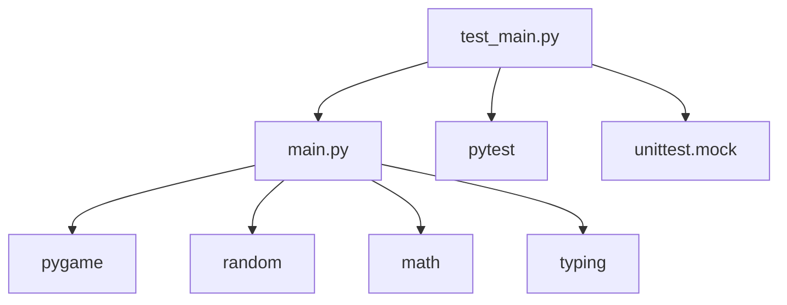
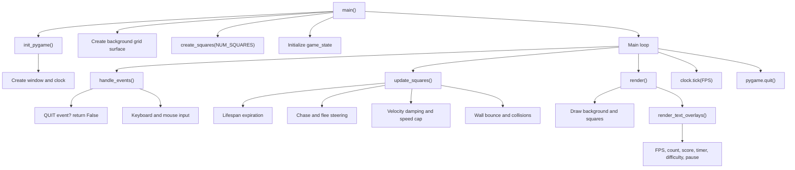
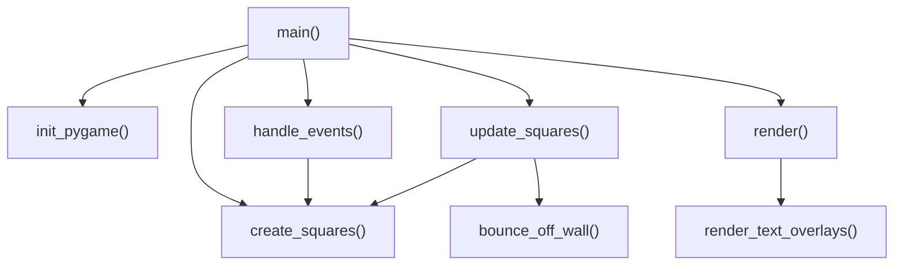
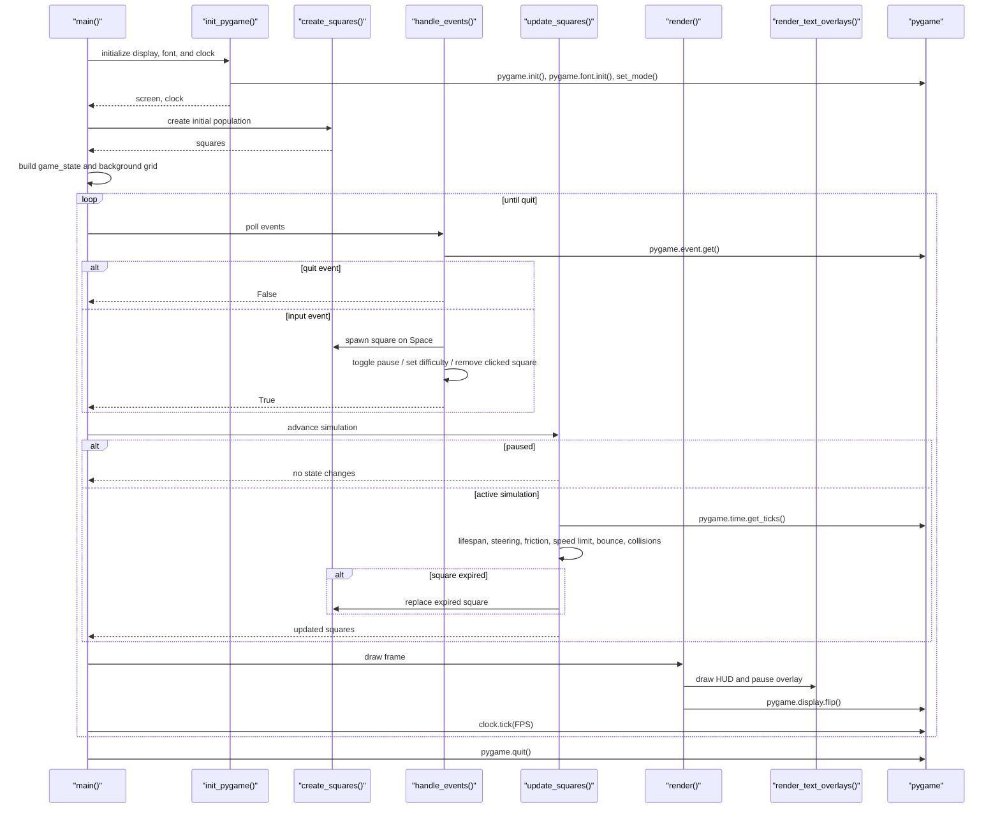

# Architecture Overview

This project is a single-file Pygame simulation with a companion test suite. The runtime centers on a standard game loop that initializes Pygame, builds the square population, processes input, updates simulation state, and renders the frame.

## Module Dependencies

`main.py` owns the runtime. `test_main.py` imports the game logic and isolates Pygame behavior with mocks.

## Runtime Flow

The simulation runs until `handle_events()` returns `False` after a quit event.

## Function Call Graph

`main()` is the orchestration point. `update_squares()` also calls `create_squares()` when a square expires and needs to be replaced.

## Primary Execution Sequence

## Data Model

Two typed dictionaries drive the runtime state:

- `Square`: stores `rect`, `pos`, `color`, `vel`, `size`, `birth_time`, and `life_span`.
- `GameState`: stores `paused`, `score`, `start_time`, and `difficulty`.

The simulation keeps `pos` as floats for smooth motion, while `rect` is updated from those floats for collision detection and rendering.

## Notes

- Lifespan checks happen inside the update loop, so expired squares are replaced without stopping the simulation.
- Smaller squares flee larger squares within `FLEE_RADIUS`; larger squares chase smaller squares within `CHASE_RADIUS`.
- Tests focus on creation, event handling, and movement behavior rather than rendering.